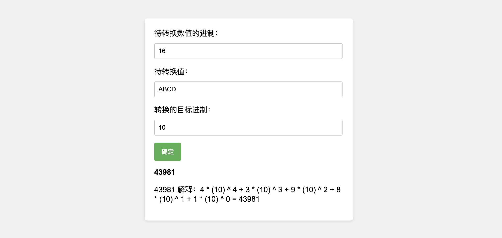

# Digital_Base_converters

数字进制转换器

## 介绍

可以将任意进制的数字转换为任意进制（一进制至六十进制）

## 特此说明

1、可输入的进制数为“ -60 ~ -1,1 ~ 60 ”.

2、待转换值过大会无法计算而显示 “计算出错”.

3、为避免歧义，本计算器将1进制的个位数设定为1.

4、二进制至六十进制的个位数，分别由01递增到 0123456789ABCDEFGHIJKLMNOPQRSTUVWXYZabcdefghijklmnopqrstuvwxyz .
      
5、待转换值需在当前进制内，否则 “计算出错”.

6、本程序仍有一些计算错误的小bug.
