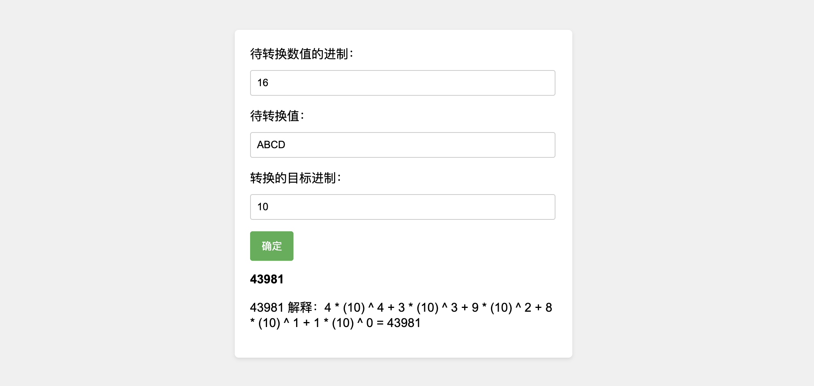

# Digital_Base_converters

Digital Base Converters

[Click to access the web page](https://che11111.github.io/Digital_Base_converters/)

## Introduction

It can convert numbers in any base to any other base (from base 1 to base 60).

## Special Notes

1. The available base numbers for input are “ -60 ~ -1, 1 ~ 60 ”.

2. If the value to be converted is too large, it will fail to calculate and display “Calculation Error”.

3. To avoid ambiguity, this calculator sets the units digit of base 1 as 1.

4. The units digits of base 2 to base 60 increase from 01 to 0123456789ABCDEFGHIJKLMNOPQRSTUVWXYZabcdefghijklmnopqrstuvwxyz respectively.

5. The value to be converted must be within the current base, otherwise “Calculation Error” will be displayed.

6. There are still some minor bugs in this program that may cause calculation errors.
